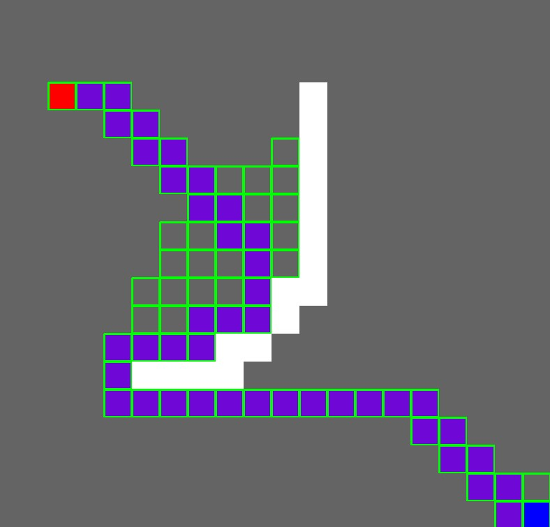

# a-star pathfinding algorithm

A pathfinding algorithm -- named A\*

- very popular
- efficient

## Used for my extended essay :)

It was quite confusing to implement but I got it done :)

- that is a lie tho
- wasn't that bad
- just coding problems :(

## Heuristics

very cool concept

- minimizes travelling to boring blocks
- various heuristics calcualtions can create unique movement patterns!

## Sample

I think I did something wrong, but here it is:

## Resources

Used following links:

http://theory.stanford.edu/~amitp/GameProgramming/AStarComparison.html
https://medium.com/@nicholas.w.swift/easy-a-star-pathfinding-7e6689c7f7b2

## Shoutout

To my own package I made for visual representation of algorithms! Since its actually so useful:

https://github.com/Ultrasword/StepBasedVisualizer
